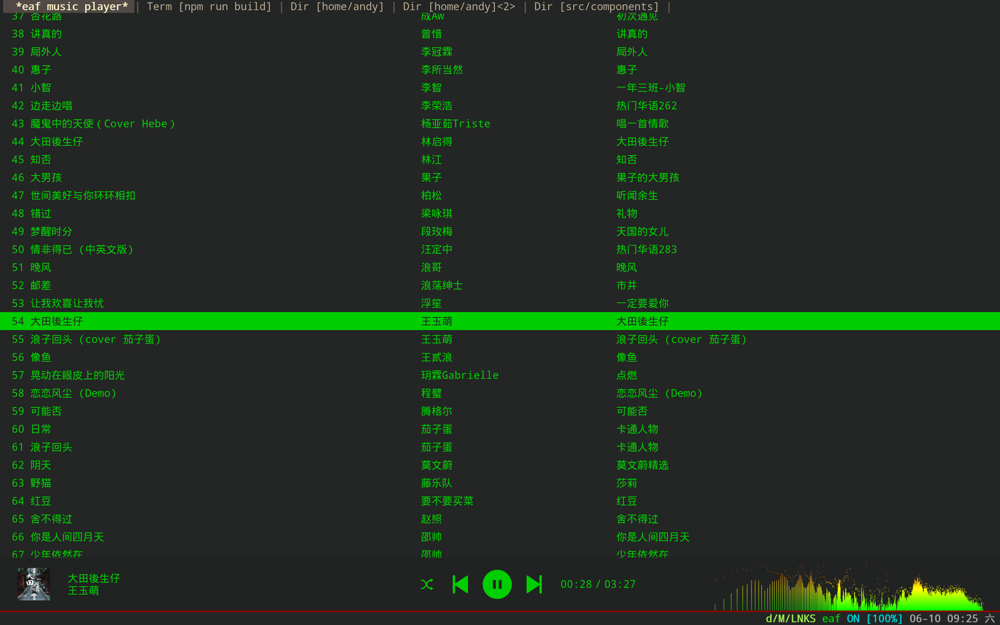

### EAF Music Player
<p align="center">
  
</p>

Music Player application for the [Emacs Application Framework](https://github.com/emacs-eaf/emacs-application-framework).

### Load application

[Install EAF](https://github.com/emacs-eaf/emacs-application-framework#install) first, then add below code in your emacs config:

```Elisp
(add-to-list 'load-path "~/.emacs.d/site-lisp/emacs-application-framework/")
(require 'eaf)
(require 'eaf-music-player)
```

### Dependency List

| Package         | Description   |
| :--------       | :------       |
| python-pytaglib | Parse ID3 tag |

### The keybinding of EAF Music Player.

| Key   | Event   |
| :---- | :------ |
| `<f12>` | open_devtools |
| `j` | js_play_next |
| `k` | js_play_prev |
| `h` | js_play_random |
| `,` | js_backward |
| `.` | js_forward |
| `SPC` | js_toggle |
| `C-n` | js_scroll_up |
| `C-p` | js_scroll_down |
| `C-v` | js_scroll_up_page |
| `M-v` | js_scroll_down_page |
| `M-<` | js_scroll_to_begin |
| `M->` | js_scroll_to_bottom |
| `g` | js_jump_to_file |
| `t` | js_toggle_play_order |
| `F` | open_link |

